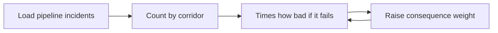
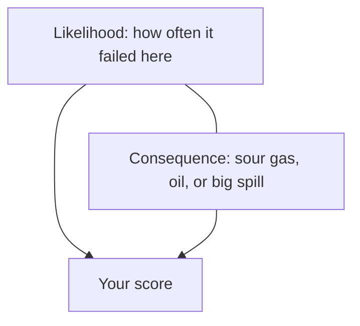

# Case 10 - Which pipelines should we inspect first?

**Stream:** Energy and Infrastructure Systems  
**Event:** IEEE YP Industry Hackathon  
**Dates:** October 2–4, 2026 | Collision Space, Hunter Hub, University of Calgary

---

## The problem (in plain words)

A **pipeline corridor** is the stretch of pipe and pumps near one town. Federally regulated lines cross Alberta carrying sweet gas, sour gas, and crude oil. When something goes wrong - a leak, a fire, a pressure breach - the regulator writes it down.

Counting “most incidents near this town” is only half the story. A small sweet-gas puff near Edson is not the same as a crude-oil spill or a sour-gas release. Counting alone sends the crew to the noisiest corridor. Weighting by **how bad it would be** sends them to the riskiest one.

**Your challenge:** Make a **top 15** inspect list. Beat a ranking that only counts incidents. Then **raise the “how bad if it fails” weight** and show how the list moves.

You ranked historic hotspots. You did **not** certify any pipe as safe.

---

## Who would use this

A pipeline integrity team (Enbridge, TC Energy, CER staff) or an Alberta contractor. You are selling a list so limited crews walk **high-consequence** corridors first, not only the noisiest ones.

---

## Steps

1. Load the incident file. Drop rows with no date. Say how many.
2. Group by `corridor` (nearest town). Count incidents.
3. Multiply by the `consequence` column (`high` / `medium` / `low` - a lab label, explained in `data/README.md`).
4. Top 15 vs count-only. Increase the high-consequence weight; count overlap.
5. Explain three corridors that rose or fell.

---

## Picture of the loop

---

## New words

| Word | Meaning |
|---|---|
| Likelihood | How often this corridor has had incidents |
| Consequence | How bad it is if it fails again (sour gas, crude oil, large spill) |
| Corridor | The pipeline stretch near one town |

---

## Watch or read (optional)

- [CER - pipeline incidents and safety](https://www.cer-rec.gc.ca/en/safety-environment/industry-performance/interactive-pipeline/index.html)
- [Open Government - Pipeline Incident Data](https://open.canada.ca/data/en/dataset/7dffedc4-23fa-440c-a36d-adf5a6cc09f1)
- [Risk = likelihood × consequence (simple overview)](https://en.wikipedia.org/wiki/Risk_matrix)

---

## Start here

1. Open a terminal **in this folder**.
2. `pip install -r requirements.txt`
3. `python agent_starter.py`
4. Change the high-consequence weight and run it again.

Data notes: [`data/README.md`](data/README.md). **Python 3.10+** (3.11 is best).
