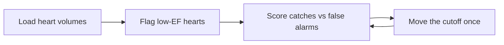

# Case 1 - Which hearts pump weakly?

**Stream:** Biomedical and Health Systems  
**Event:** IEEE YP Industry Hackathon  
**Dates:** October 2–4, 2026 | Collision Space, Hunter Hub, University of Calgary

---

## The problem (in plain words)

Every heartbeat squeezes blood out of the heart. A cardiac MRI measures two numbers: how full the heart is before the squeeze (**EDV**) and how much is left after (**ESV**). The share that got pumped out is the **ejection fraction**. Healthy hearts push out more than half. Failing hearts leave too much behind.

A cardiologist reads dozens of these scans a week. Your job is simpler: read one row of numbers per patient and say **normal pump** or **weak pump**.

**Your challenge:** Flag the weak pumps. Beat “always say normal.” Then **move the cutoff once** and show whether you catch more weak hearts or just scare more healthy ones.

---

## Who would use this

A cardiologist or MRI technologist triaging a read list. You are selling **the urgent scans first**, so a weak heart never waits behind twenty healthy ones.

---

## Steps

1. Load the heart file. Drop rows with missing volumes. Say how many.
2. Compute ejection fraction yourself: `(EDV − ESV) / EDV × 100`. Check it matches the `ef_pct` column.
3. Call a heart “weak” in one sentence (example: EF below 40%).
4. Score caught weak hearts vs false alarms against always-normal. Move the cutoff once (40% to 50%) and score again.
5. Write three sentences: weak hearts caught, false alarms, when the rule would fail.

---

## Picture of the loop

**Always-normal** means you never flag anyone. It looks accurate because weak hearts are only half the list - but it catches nobody.

---

## New words

| Word | Meaning |
|---|---|
| Ejection fraction (EF) | Share of blood the heart pumps out each beat (percent); below 40% is a failing pump |
| EDV / ESV | Heart volume full (before squeeze) / empty (after squeeze), in millilitres |
| False alarm | Flagging a healthy heart as weak |

---

## Watch or read (optional)

- [Ejection fraction - what the number means (overview)](https://en.wikipedia.org/wiki/Ejection_fraction)
- [Sunnybrook Cardiac Data - where these numbers come from](https://www.cardiacatlas.org/sunnybrook-cardiac-data/)
- [Heart diseases and conditions in Canada (Public Health Agency of Canada)](https://www.canada.ca/en/public-health/services/diseases/heart-health/heart-diseases-conditions.html)
- [Precision and recall in one picture](https://en.wikipedia.org/wiki/Precision_and_recall)

---

## Start here

1. Open a terminal **in this folder**.
2. `pip install -r requirements.txt`
3. `python agent_starter.py`
4. Change `EF_CUTOFF` from 40 to 50 and run it again.

Data notes: [`data/README.md`](data/README.md). **Python 3.10+** (3.11 is best).
